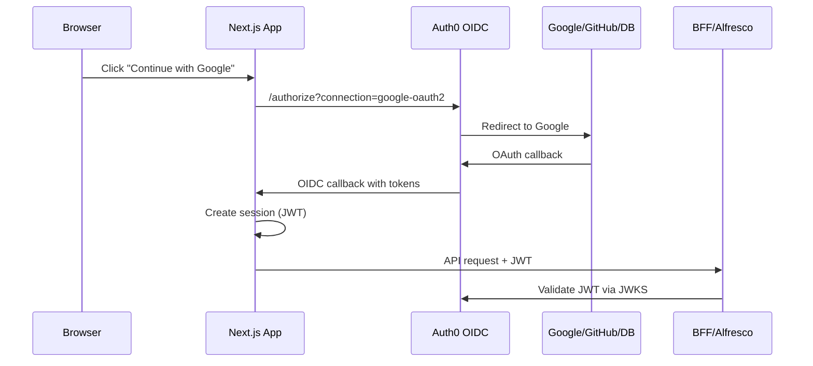

# Auth0 Integration for MIOT apps/app

## Current State Analysis

The `apps/app` already has a solid authentication foundation:

- **NextAuth v5** (`next-auth@5.0.0-beta.30`) is configured
- **Custom login UI** with configurable providers via `AUTH_PROVIDERS` env var
- **Provider abstraction** in `[src/features/auth/config/auth-providers.config.ts](apps/app/src/features/auth/config/auth-providers.config.ts)`
- **Direct OAuth providers**: Google, GitHub, Microsoft Entra ID currently connect directly

The goal is to **replace direct OAuth connections with Auth0 as the OIDC broker** while keeping the custom login UI.

---

## Architecture Overview




---

## Part 1: Auth0 Configuration (Admin Console)

### Step 1: Create Auth0 Application

1. Go to **Applications > Create Application**
2. Choose **Regular Web Application**
3. Name: `MIOT Web App`
4. Configure:
  - **Allowed Callback URLs**: `https://your-domain.com/app/api/auth/callback/auth0`, `http://localhost:3000/app/api/auth/callback/auth0`
  - **Allowed Logout URLs**: `https://your-domain.com/app`, `http://localhost:3000/app`
  - **Allowed Web Origins**: `https://your-domain.com`, `http://localhost:3000`

### Step 2: Create Auth0 API (Audience)

1. Go to **Applications > APIs > Create API**
2. Name: `MIOT API`
3. Identifier (audience): `miot-api` (this becomes `AUTH_AUTH0_AUDIENCE`)
4. Signing Algorithm: **RS256**

### Step 3: Enable Social Connections

1. Go to **Authentication > Social**
2. Enable **Google** connection:
  - Create Google OAuth credentials in Google Cloud Console
  - Configure Client ID and Secret in Auth0
3. Enable **GitHub** connection:
  - Create GitHub OAuth App
  - Configure Client ID and Secret in Auth0

### Step 4: Create Database Connection (for email/password)

1. Go to **Authentication > Database > Create Connection**
2. Name: `Username-Password-Authentication`
3. Enable for MIOT application
4. Configure password policy as needed

### Step 5: Configure Token Claims (Auth0 Actions)

Create a **Post Login Action** to add custom claims:

```javascript
exports.onExecutePostLogin = async (event, api) => {
  const namespace = 'https://miot.cl/claims/';
  
  // Add provider information
  api.idToken.setCustomClaim(`${namespace}provider`, event.connection.name);
  api.accessToken.setCustomClaim(`${namespace}provider`, event.connection.name);
  
  // Map connection names to friendly provider names
  const providerMap = {
    'google-oauth2': 'google',
    'github': 'github',
    'Username-Password-Authentication': 'auth0'
  };
  
  api.idToken.setCustomClaim(
    `${namespace}identity_provider`, 
    providerMap[event.connection.name] || event.connection.name
  );
};
```

---

## Part 2: Next.js Implementation

### Step 1: Update Environment Variables

Add to `.env.local`:

```bash
# Auth0 Configuration
AUTH_SECRET="generate-with-openssl-rand-base64-32"
AUTH_AUTH0_ID="your-client-id"
AUTH_AUTH0_SECRET="your-client-secret"
AUTH_AUTH0_ISSUER="https://your-tenant.auth0.com"
AUTH_AUTH0_AUDIENCE="miot-api"
NEXTAUTH_URL="http://localhost:3000/app"

# Provider configuration (simplified format)
AUTH_PROVIDERS="google,github,credentials"
```

### Step 2: Add Auth0 Provider to auth.config.ts

Modify `[src/auth.config.ts](apps/app/src/auth.config.ts)` to add Auth0 as a provider:

```typescript
import Auth0 from "next-auth/providers/auth0";

function buildAuthProviders(): NextAuthConfig["providers"] {
  const providers: NextAuthConfig["providers"] = [];

  // Auth0 as OIDC broker (primary)
  if (
    process.env.AUTH_AUTH0_ID &&
    process.env.AUTH_AUTH0_SECRET &&
    process.env.AUTH_AUTH0_ISSUER
  ) {
    providers.push(
      Auth0({
        clientId: process.env.AUTH_AUTH0_ID,
        clientSecret: process.env.AUTH_AUTH0_SECRET,
        issuer: process.env.AUTH_AUTH0_ISSUER,
        authorization: {
          params: {
            audience: process.env.AUTH_AUTH0_AUDIENCE,
            scope: "openid profile email offline_access",
          },
        },
      })
    );
  }

  return providers;
}
```

### Step 3: Create Connection-Specific Sign-In Functions

Update `[src/features/auth/services/auth.service.ts](apps/app/src/features/auth/services/auth.service.ts)`:

```typescript
export async function signInWithAuth0Google(): Promise<void> {
  await signIn("auth0", {
    redirectTo: "/app",
    authorizationParams: {
      connection: "google-oauth2",
    },
  });
}

export async function signInWithAuth0GitHub(): Promise<void> {
  await signIn("auth0", {
    redirectTo: "/app",
    authorizationParams: {
      connection: "github",
    },
  });
}

export async function signInWithAuth0Credentials(
  email: string,
  password: string
): Promise<void> {
  // Uses Auth0 Resource Owner Password Grant (requires configuration)
  // Or redirect to Auth0 with connection hint
  await signIn("auth0", {
    redirectTo: "/app",
    authorizationParams: {
      connection: "Username-Password-Authentication",
      login_hint: email,
    },
  });
}
```

### Step 4: Update JWT Callback for Auth0 Tokens

The JWT callback in `[src/auth.config.ts](apps/app/src/auth.config.ts)` needs to handle Auth0 tokens:

```typescript
async jwt({ token, user, account }) {
  if (account && account.provider === "auth0") {
    // Store the Auth0 access token (for API calls)
    token.accessToken = account.access_token;
    token.idToken = account.id_token;
    token.refreshToken = account.refresh_token;
    token.accessTokenExpiresAt = account.expires_at;
    
    // Make access token available for backend validation
    token.rawJWT = account.access_token;
  }
  return token;
}
```

### Step 5: Update Provider Metadata

Update `[src/features/auth/config/auth-providers.config.ts](apps/app/src/features/auth/config/auth-providers.config.ts)`:

```typescript
const PROVIDER_METADATA: Record<string, {...}> = {
  "auth0-google": { type: "oauth", icon: "google" },
  "auth0-github": { type: "oauth", icon: "github" },
  "auth0-credentials": { type: "credentials", icon: "user" },
  // Keep existing for backward compatibility
  google: { type: "oauth", icon: "google" },
  github: { type: "oauth", icon: "github" },
};
```

---

## Part 3: Backend JWT Validation

The BFF can validate Auth0 JWTs using the JWKS endpoint:

**JWKS URL**: `https://your-tenant.auth0.com/.well-known/jwks.json`

Validation checks:

- `iss`: Must match `https://your-tenant.auth0.com/`
- `aud`: Must include `miot-api`
- `exp`: Must not be expired
- Signature: Verify using JWKS public keys

---

## Key Files to Modify


| File                                                                                                                       | Changes                                 |
| -------------------------------------------------------------------------------------------------------------------------- | --------------------------------------- |
| `[apps/app/src/auth.config.ts](apps/app/src/auth.config.ts)`                                                               | Add Auth0 provider, update JWT callback |
| `[apps/app/src/features/auth/services/auth.service.ts](apps/app/src/features/auth/services/auth.service.ts)`               | Add Auth0-specific sign-in functions    |
| `[apps/app/src/features/auth/config/auth-providers.config.ts](apps/app/src/features/auth/config/auth-providers.config.ts)` | Update provider metadata                |
| `.env.local`                                                                                                               | Add Auth0 environment variables         |


---

## Migration Strategy

**Phase 1**: Add Auth0 provider alongside existing providers
**Phase 2**: Test with `AUTH_PROVIDERS=auth0-google,auth0-github,auth0-credentials`
**Phase 3**: Remove direct OAuth providers once Auth0 flow is validated

---

## Important Considerations

1. **No Auth0 UI**: Use `connection` parameter to skip Universal Login
2. **Credentials Flow**: Auth0 Resource Owner Password Grant requires enabling in Advanced Settings
3. **Token Audience**: Must configure API in Auth0 to get proper `aud` claim
4. **Refresh Tokens**: Enable "Refresh Token Rotation" in Auth0 for security
5. **Google OAuth consent screen**: The app name on the OAuth consent screen (e.g. "ModularIoT") must match the app name on your home page. The web-site (`apps/web-site`) uses "ModularIoT" (no space) consistently so it aligns with Google's verification requirement.

