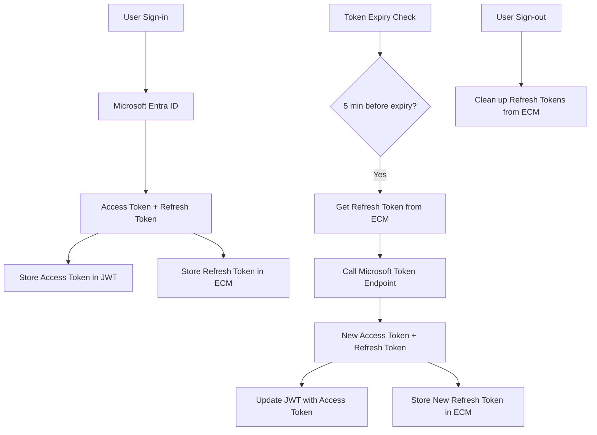

# ECM-Backed Refresh Token Implementation

This implementation provides persistent refresh token storage using ECM webscript endpoints instead of storing refresh tokens in JWT cookies.

## Key Features

### 🔐 Secure Storage

- Refresh tokens are stored in ECM backend, not in client-side cookies
- Only access tokens are stored in JWT (shorter-lived, less sensitive)
- Automatic cleanup on sign-out

### ⏰ Early Refresh Logic

- Tokens are refreshed **5 minutes before expiration** to prevent session invalidation
- Configurable refresh window in `shouldRefresh()` function
- Prevents race conditions and user experience interruptions

### 🔄 Automatic Token Rotation

- New refresh tokens are automatically stored in ECM after successful refresh
- Old tokens are replaced to maintain security
- Fallback handling if ECM storage fails

## Architecture



## Files Overview

### Core Services

- **`entra-token.service.ts`** - Core token refresh logic with Microsoft (shouldRefresh, refreshAccessToken)
- **`entra-token-ecm.service.ts`** - ECM-backed service layer with business logic:
  - `processMicrosoftEntraAccount()` - Handle sign-in account processing
  - `processTokenRefresh()` - Handle token refresh logic
  - `refreshAccessTokenWithEcmPersistence()` - Core refresh with ECM storage
- **`alfresco-api.provider.ts`** - ECM API endpoints for refresh token CRUD

### Configuration

- **`auth.config.ts`** - Clean NextAuth configuration delegating to service layer

### API Endpoints

- **`GET /alfresco/s/common/refresh-token`** - Retrieve stored refresh tokens
- **`PUT /alfresco/s/common/refresh-token`** - Store/update refresh tokens

## Usage

### Testing the Implementation

Use the test endpoint to verify functionality:

```bash
# Test token retrieval
GET /api/test-refresh-token

# Test token storage
POST /api/test-refresh-token
{
  "testToken": "your-test-refresh-token"
}
```

### Configuration

Ensure these environment variables are set:

```env
AUTH_MICROSOFT_ENTRA_ID_ID=your-client-id
AUTH_MICROSOFT_ENTRA_ID_SECRET=your-client-secret
AUTH_MICROSOFT_ENTRA_ID_ISSUER=https://login.microsoftonline.com/your-tenant-id/v2.0
AUTH_MICROSOFT_ENTRA_RESOURCE_URI=optional-resource-uri
ECM_API_URL=your-ecm-api-url
```

## Security Benefits

1. **Reduced Attack Surface**: Refresh tokens not exposed in client-side storage
2. **Centralized Management**: All tokens managed through ECM backend
3. **Automatic Cleanup**: Tokens removed on sign-out
4. **Early Refresh**: Prevents session expiration during user activity

## Migration Notes

- **Before**: Refresh tokens stored in JWT cookies
- **After**: Only access tokens in JWT, refresh tokens in ECM
- **Compatibility**: Existing sessions will continue to work during transition
- **Fallback**: If ECM storage fails, system gracefully handles errors

## Monitoring

The implementation includes comprehensive logging:

- Token refresh attempts and results
- ECM storage operations
- Error conditions and fallbacks
- Performance metrics

Check logs with these prefixes:

- `auth.providers.microsoft` - Microsoft Entra ID operations
- `auth.jwt` - JWT processing
- `alfresco-api` - ECM API calls
- `entra-token` - Token refresh operations
