# MIOT Harness Architecture

## Runtime Contract

The harness owns:

- intent routing
- agent and subagent orchestration
- typed tool registry
- permission and approval decisions
- event streaming
- run state
- Storytelling artifact creation
- evidence and audit references

The model is allowed to plan and draft. It is not allowed to bypass tool
schemas, tenant scoping, or approval gates.

## Agent Topology

```mermaid
flowchart TD
  API["ASK MIOT API"] --> Router["Intent Router"]
  Router -->|simple| Direct["Direct Tool Answer"]
  Router -->|complex| Supervisor["Deep Agent Supervisor"]
  Supervisor --> Planner["Planning Middleware"]
  Supervisor --> Analyst["Compliance Analyst Subagent"]
  Supervisor --> Narrator["Storytelling Subagent"]
  Supervisor --> Visualizer["Dashboard Visualizer Subagent"]
  Analyst --> Metrics["Delivery Metrics Tool"]
  Analyst --> Workflow["Workflow Bottlenecks Tool"]
  Narrator --> Story["Story Artifact"]
  Visualizer --> Widget["Widget Draft"]
  Widget --> Approval["Approval Gate"]
```

## Folder Responsibilities

`runtime/` contains MIOT-owned contracts that should remain stable even if the
agent framework changes.

`agents/` contains LangChain Deep Agents adapters and subagent prompts.

`tools/` contains MIOT-native capabilities. These are the only way agents should
touch operational data or propose mutations.

`storytelling/` contains strict artifact schemas that can later map into the
existing app Storytelling UI.

`skills/` contains progressive disclosure material: small manifests first, full
playbooks only when relevant.

`workspace/` starts as local JSON persistence and can later be replaced by
Postgres, object storage, LangGraph persistence, or a service backend.

