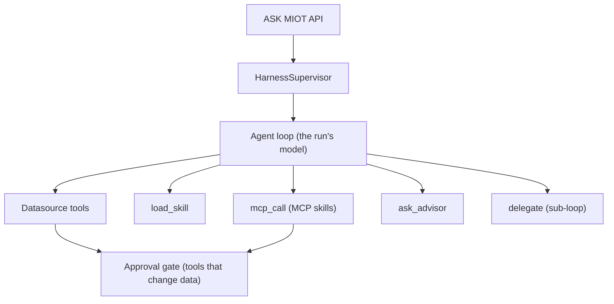

# MIOT Harness Architecture

## Runtime contract

The harness owns:

- the typed tool registry
- permission and approval decisions
- tenant scoping of datasource access
- conversation memory
- event streaming and run records
- evidence and provenance

The model decides which tools to call and writes the answer. It cannot bypass
tool schemas, tenant scoping or approval gates.

## Topology

```mermaid
flowchart TD
  API["ASK MIOT API"] --> Supervisor["HarnessSupervisor"]
  Supervisor --> Loop["Agent loop (the run's model)"]
  Loop --> Data["Datasource tools"]
  Loop --> Skills["load_skill"]
  Loop --> MCP["mcp_call (MCP skills)"]
  Loop --> Advisor["ask_advisor"]
  Loop --> Workhorse["delegate (sub-loop)"]
  Data --> Approval["Approval gate (tools that change data)"]
  MCP --> Approval
```

The supervisor resolves the permission policy, replays the conversation, adds
the tenant's context and any invoked skill, runs the loop, then stores the turn
and compacts long conversations.

## Folders

| Folder | Holds |
|---|---|
| `runtime/` | Supervisor, agent loop, seats, tools, permissions, conversation store |
| `agents/` | Chat model factory, conversation summarizer, native tool schemas |
| `datasource/`, `integrations/` | Datasource providers and their tools |
| `context_skills/` | System context, skills, MCP skills |
| `tools/` | Harness-owned tools (filesystem scratchpad, dashboard, story drafts) |
| `api/` | FastAPI server, auth, identity |
| `workspace/` | Local JSON persistence for run records |
