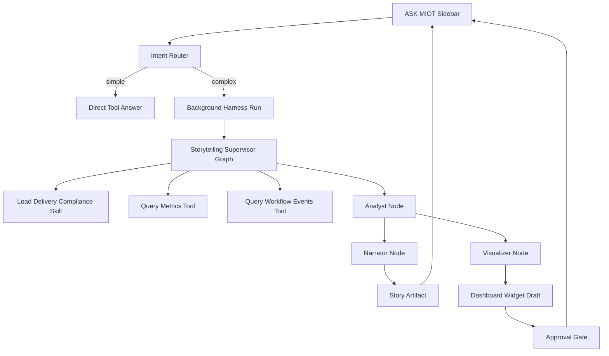

# ASK MIOT Harness Research

This note captures the architecture research for the ModularIoT AI-first strategy before implementation starts. It combines three inputs:

- The `../ui_kits/modulariot-shell` proposal for ASK MIOT, Storytelling, chat sidebar, and command/search reinterpretation.
- A local assessment of the leaked Claude Code harness source as an architectural reference.
- The article "How We Built an AI Agent Harness That Actually Does Security" as a second harness pattern focused on long-running, stateful operations.

The goal is not to copy either system. The goal is to extract clean-room architecture principles for a small ASK MIOT proof of concept.

## Product Reading

ASK MIOT should not be a chatbot beside the product. It should be a harnessed operator inside the product.

That means the AI layer should be able to:

- Explain operational data in natural language.
- Query tenant-scoped MIOT data through typed capabilities.
- Generate MIOT-native artifacts such as Storytelling pages, dashboard widget drafts, relationship graphs, and action proposals.
- Execute mutating actions only through approval-gated, auditable capability calls.

The UI proposal implies four product changes:

- A global floating ASK MIOT entry point.
- A persistent right-side chat sidebar.
- Search reinterpreted as command, ask, build, and navigate.
- Storytelling as a first-class workspace for generated, editable, data-bound narratives.

The proposal sidebar should not be ported directly. The current app already has the newer icon rail plus secondary panel architecture, so ASK MIOT should adapt to the existing shell rather than replace it.

## Harness Definition

A harness is the controlled runtime around the model. It owns execution, context, safety, state, and knowledge.

In practice, a harness provides:

- Intent routing.
- Tool and capability registry.
- Schema validation.
- Permission checks.
- Progress streaming.
- Context management.
- Persistent workspace state.
- Artifact generation.
- Human approval for mutations.
- Audit logs and evidence references.

The model plans and narrates. The harness executes and enforces boundaries.

## Claude Code Lessons

Claude Code is useful as a harness specimen because its core is not an "agent class"; it is a loop with strict contracts:

1. Send messages plus tool schemas to the model.
2. Stream assistant text and tool-use blocks.
3. Validate tool input with schemas.
4. Run tool-specific validation.
5. Check permissions.
6. Execute the tool.
7. Convert output into a tool-result message.
8. Continue until the model no longer requests tools.

Patterns worth borrowing conceptually:

- Tools are typed product boundaries. A tool declares its schema, permission model, read-only/destructive status, execution behavior, progress events, UI labels, and result mapping.
- Permission is first-class. Decisions are not just booleans; they can allow, deny, ask, carry reasons, and optionally modify input.
- Read-only tools can run concurrently. Mutating or destructive tools should run serially.
- Hooks around tool execution allow policy, audit, observability, and workflow-specific behavior to attach without bloating each tool.
- Large tool results need budgeting, summarization, or storage outside the model context.
- The same core harness can serve multiple UIs: CLI, SDK, remote session, or MIOT sidebar.

Patterns not needed for the first MIOT POC:

- Shell/file editing as primary primitives.
- Full CLI permission modes.
- Multi-agent team/task management.
- Remote bridge machinery.
- Large plugin and skill marketplaces.

## Security Harness Article Lessons

The security harness article reinforces the same deeper pattern but with long-running operations.

Useful concepts for MIOT:

- Dual-mode routing: simple requests should be answered directly; complex analysis should run as background jobs with streamed progress.
- Supervisor orchestration: a supervisor plans, delegates, and synthesizes; domain expertise lives in specialist nodes or skills.
- Execution backend abstraction: tools should not care whether data comes from BFF APIs, PgREST, Alfresco, telemetry services, or future workers.
- Persistent workspaces: long-running analysis needs durable files, structured artifacts, generated insights, credentials/config, and approval history.
- Progressive skill disclosure: load short skill manifests first, then full playbooks only when relevant.
- Generated insights: AI output should include structured visual artifacts, not only prose.
- Approval gates: every mutation should be intercepted, presented to the user, and logged.

For MIOT, the security-specific execution pieces such as exploit sandboxes, SSH shells, browser pentesting, and credential injection are not first-PoC requirements. The architectural lesson is the harness integration, not the security domain.

## ASK MIOT POC Architecture

The first POC should prove one vertical slice:

User asks: "Tell me the story of delivery compliance this month and suggest one dashboard widget."

Expected result:

- A structured narrative with sections.
- Evidence-backed metrics.
- A workflow bottleneck explanation.
- A proposed dashboard widget draft.
- An approval card to add the widget.

Proposed flow:



## Proposed Modules

```text
features/miot-agent/
  runtime/
    router
    supervisor-graph
    run-store
    stream-events

  tools/
    registry
    permission
    delivery-metrics
    workflow-events
    dashboard-draft
    storytelling

  skills/
    manifests
    loader
    delivery-compliance-story.md

  workspace/
    stories
    artifacts
    evidence
    approvals

  ui/
    ask-miot-button
    chat-sidebar
    progress-trace
    artifact-card
    approval-card
```

## Core Contracts

The POC should start with a small tool interface:

```ts
type HarnessPermission = "allow" | "ask" | "deny";

type HarnessTool<Input, Output> = {
  name: string;
  description: string;
  inputSchema: z.ZodSchema<Input>;
  outputSchema: z.ZodSchema<Output>;
  readOnly: boolean;
  destructive?: boolean;
  checkPermission(ctx: HarnessContext, input: Input): Promise<HarnessPermission>;
  call(
    ctx: HarnessContext,
    input: Input,
    progress: (event: HarnessProgressEvent) => void
  ): Promise<Output>;
};
```

Artifact outputs should be strict schemas, for example:

```ts
type MiotInsight =
  | { type: "story"; sections: StorySection[]; evidence: EvidenceRef[] }
  | { type: "dashboard_patch"; widgets: WidgetDraft[]; evidence: EvidenceRef[] }
  | { type: "graph"; nodes: InsightNode[]; edges: InsightEdge[]; evidence: EvidenceRef[] }
  | { type: "action_proposal"; action: string; requiresApproval: true; evidence: EvidenceRef[] };
```

## Initial Tools

The first tool set should be MIOT-native:

- `getDeliveryComplianceMetrics`
- `getWorkflowBottlenecks`
- `getDashboardContext`
- `createStoryDraft`
- `createDashboardWidgetDraft`
- `applyDashboardPatch`, approval required

Operational metric answers should come from typed API or SQL tools, not vector search. Retrieval/RAG is useful for unstructured context, client notes, playbooks, workflow descriptions, and prior stories.

## Context And State

The harness should keep enough state to make AI work durable:

- conversation thread id
- tenant/site/user context
- route/page context
- active dashboard/story context
- generated artifacts
- evidence references
- approval decisions
- tool-call trace
- background run status

For a POC, this can be lightweight and app-local. The architecture should leave room for durable persistence later.

## Safety Defaults

Default posture:

- Read-only analysis can run automatically.
- Artifact drafts can be generated automatically.
- Mutations require approval.
- Tool calls must be tenant-scoped by server context, not model-provided tenant text.
- Every generated answer should carry evidence references where practical.
- Every approval or rejection should be stored in the run history.

## Implementation Guidance

Keep the first implementation intentionally small:

- One router.
- One supervisor graph or equivalent state machine.
- One skill.
- Two read-only data tools.
- One story artifact tool.
- One dashboard widget draft.
- One approval-gated apply action.

Avoid introducing broad multi-agent machinery until the single vertical slice works end to end.

## Open Decisions

- Whether the first POC uses real MIOT data or seeded/mock delivery compliance data.
- Whether background execution uses an in-process async run first or a worker queue.
- Where to persist story artifacts initially.
- How much of the existing dashboard context should be exposed to the harness in the first slice.
- How the global navbar search and local sidebar searches should hand off to ASK MIOT without breaking current URL filter behavior.
