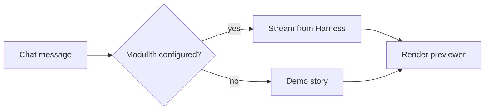

# MIOT Stack — Release Notes

_Testing content for the storytelling Markdown previewer — not real release notes._

## Highlights

- **Faster dashboards** — the Torre de Control dashboard no longer blocks the UI thread while loading its dataset.
- **Dark mode everywhere** — embedded dashboards now follow the app's own light/dark theme automatically.
- New **Ask Harness** action lets you reference any dashboard component directly in a chat message.

## Fixes

1. Fixed the breadcrumb doing a full page reload instead of a client-side navigation.
2. Fixed filter checkboxes and dropdowns not being interactive after the async data-loading refactor.
3. Fixed the delete confirmation modal's dark-mode background and border colors.

## Known issues

> Diagram theming follows the app on load; flipping light/dark while a story is open re-renders diagrams but not always instantly.

## Example diagram



## Example code block

```ts
export function greet(name: string): string {
  return `Hello, ${name}!`;
}
```

## Example table

| Component | Status |
| --- | --- |
| HTML previewer | ✅ Working |
| Markdown previewer | ✅ Working |
| PPT previewer | ✅ Working |
| PDF previewer | ✅ Working |

---

[Back to Storytelling](/storytelling)
