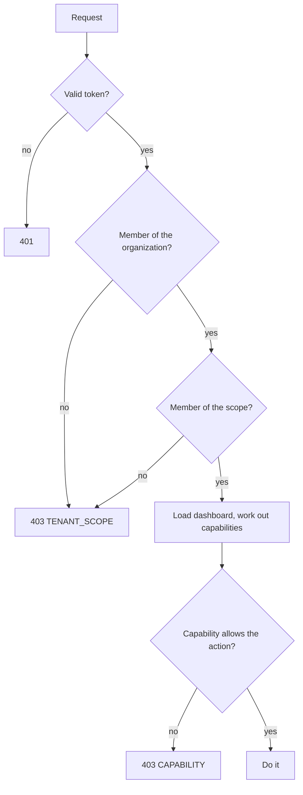

# Organizations, scopes and roles

Access to a dashboard depends on three things: the organization, the scope inside it, and the role the person holds there.

## Vocabulary

| Term | Is | In the address |
| --- | --- | --- |
| Organization (tenant) | A customer or company. Its dashboards and data never mix with another's. | `/tenants/{tenantId}` |
| Scope | An area inside the organization: a team, a site, a region | `/scopes/{scopeId}` |
| Role | What a person may do in a scope | Not in the address; looked up on each request |
| Dashboard permission | An extra role one dashboard gives to a person or group | `/dashboards/{slug}/permissions` |

One person can belong to several organizations, with a different role in each. Switching organization is a different address, not a new token.

## Roles

Roles are ordered. Each one can do everything the roles before it can.

| Role | View | Create | Edit own | Edit any | Share | Manage permissions | Delete |
| --- | --- | --- | --- | --- | --- | --- | --- |
| Consumer | ✓ | | | | | | |
| Contributor | ✓ | ✓ | ✓ | | | | |
| Editor | ✓ | ✓ | ✓ | ✓ | ✓ | | |
| Coordinator | ✓ | ✓ | ✓ | ✓ | ✓ | ✓ | ✓ |

"Edit own" means dashboards the person created. The server records the creator on the first save.

## How a request is checked

An organization the person does not belong to and one that does not exist give the same answer. So does a scope. Nobody can use the address to find out what exists.

## Capabilities

The server turns the role, the dashboard's permissions and its policy into five flags. The UI uses them to decide which controls to show:

| Capability | Allows |
| --- | --- |
| `readOnly` | Nothing beyond viewing, when true |
| `canEdit` | Saving the dashboard |
| `canShare` | Sharing it |
| `canManagePermissions` | Changing its permissions |
| `canDelete` | Deleting it |

Creating a dashboard is a scope-level question: `GET /tenants/{t}/scopes/{s}/capabilities` returns `{"canCreate": true}` for Contributors and above.

## How roles combine

- **Dashboard permissions add.** A Consumer in the scope with an Editor permission on one dashboard can edit that dashboard.
- **Policies only take away.** `allowedGroups`, or a custom policy in an embedded server, can hide a dashboard from someone whose role would allow it. They can never grant more than the role.
- **The identity sets a ceiling.** If the token or ticket says a person may not edit, no role or permission lets them.

## Where memberships come from

| Setup | Organization and scope membership |
| --- | --- |
| ModularIoT web app | ModularIoT organizations and roles |
| Standalone, small | A membership file (`MIOT_DASHBOARD_SEED`) |
| Standalone, with a directory | Lookups to your directory (`MIOT_DASHBOARD_TENANTS_URL`, `MIOT_DASHBOARD_SCOPES_URL`) |

See [Authenticate users](/en/products/dashboards/how-to/authenticate-users).
