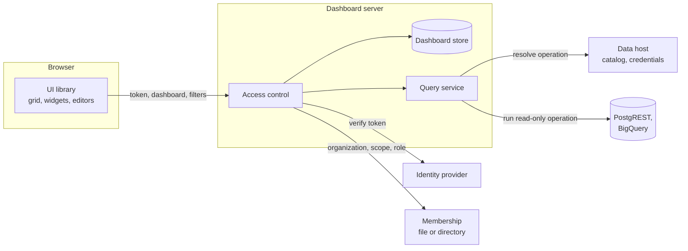

# Architecture

Dashboards splits the work between the browser, the dashboard server and the systems you already run. Each part does one job, and secrets never move toward the browser.

## The parts

| Part | Does | Does not |
| --- | --- | --- |
| **UI library** | Draws widgets, lays out the grid, edits documents, shows query results | Store tokens, hold credentials, run SQL, decide access |
| **Dashboard server** | Stores documents, checks every request, runs saved queries within limits | Render pages, keep sessions |
| **Contract** | Defines the document, roles, errors and API both sides use | Run anything |
| **Identity provider** | Signs people in and issues tokens | Know about dashboards |
| **Data host** | Owns connections, operations and credentials | Accept SQL or URLs from dashboards |

## A request, step by step

When a viewer opens a dashboard:

1. The page asks the server for the dashboard, with the viewer's token.
2. The server verifies the token, then checks that the viewer belongs to the organization and the scope in the address. A failure stops here with 401 or 403.
3. The server loads the document, works out the viewer's capabilities, and returns both with the current revision.
4. The page draws the widgets and asks for each saved query's results, sending only filter values.
5. For each query, the server checks access again, takes the operation and parameter bindings from the **stored** document, and fills in the filter values.
6. The data host resolves the operation for that organization: the connection, the credential and any organization predicate.
7. The server runs the read-only operation with deadlines and size limits, and returns only rows.

The browser never sends a connection, an operation definition, a URL or SQL. It only names a saved query by ID.

## Two places to run queries

| Where | How | Use it for |
| --- | --- | --- |
| In the dashboard server | A query executor module resolves the plan with the data host, then calls PostgREST or BigQuery itself | The standard setup, including with ModularIoT |
| In the data host | The server forwards the authorized request to a private host endpoint, which runs it | Hosts that must run queries themselves |

Either way the browser sees the same API. See [Queries and connections](/en/products/dashboards/concepts/queries-and-connections).

## Deployment shapes

| Shape | Server runs as | Identity | Credentials |
| --- | --- | --- | --- |
| With ModularIoT | A pod next to the modulith | The web app's session, forwarded by its proxy | ModularIoT connections |
| Standalone | npm, Docker or Helm | Your JWT or ticket issuer | The server's encrypted store, or another system |
| Embedded library | Inside your Node.js backend | Your code | Your code |

## Design rules

- **Fail closed.** An unknown value, a malformed group list, or an unreachable directory denies access. It never grants it.
- **Same answer for "not yours" and "does not exist".** The address cannot be used to discover organizations, scopes or dashboards.
- **No secret in a response.** Credential routes return summaries. Errors carry no upstream details.
- **Bounded work.** Every query has a deadline, a row limit, a size limit and a concurrency limit.
- **The document is portable.** Unknown fields pass through every save, so a newer UI and an older server can share documents.
