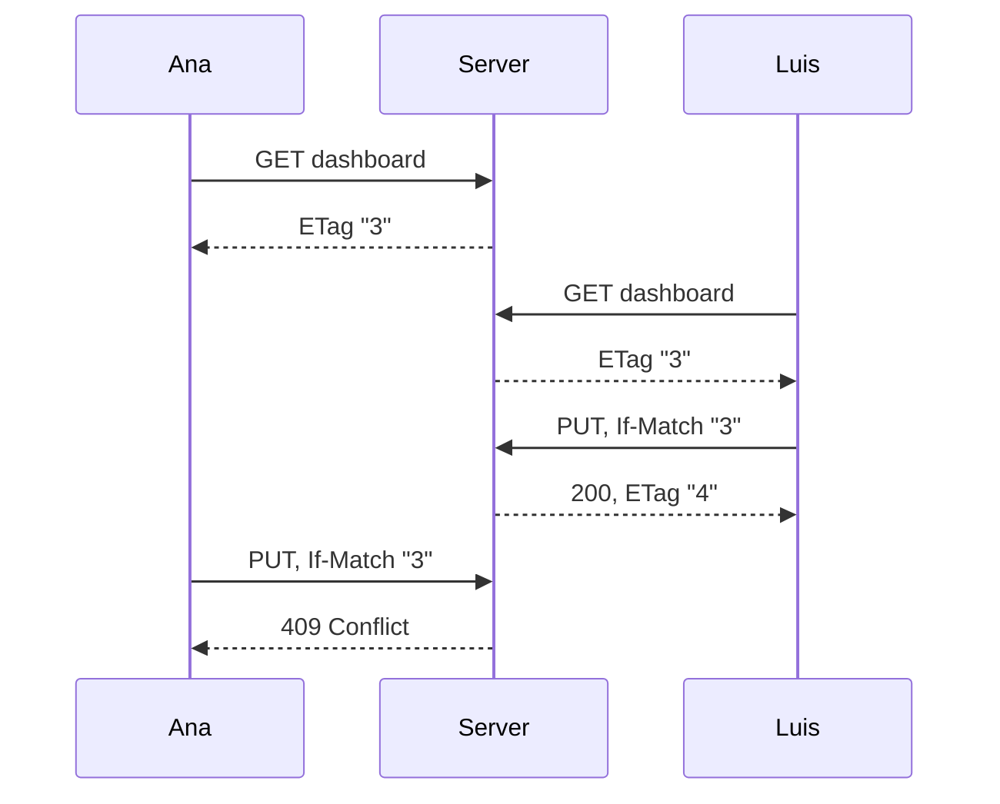

# Revisions and saving

Two people can edit the same dashboard at the same time. Revisions make sure neither silently overwrites the other.

## How revisions work

Every dashboard has a revision number that goes up by one on each save.

1. Loading a dashboard returns its revision in the `ETag` header, such as `"3"`.
2. Saving sends that value back in `If-Match: "3"`.
3. If the dashboard is still at revision 3, the save succeeds and returns `ETag: "4"`.
4. If someone saved in between, the server answers **409 Conflict** and stores nothing.

## Creating without clobbering

A dashboard that does not exist loads as `data: null` with `ETag: "0"`. Saving with `If-Match: "0"` creates it only if nobody else created it first.

## After a conflict

Keep the person's edits and let them compare with the latest version. Do not resend the old document with the new revision: that would erase the other person's changes.

In the web app, a conflict shows **Unsaved changes** and a **Reload** button. Your edits stay on screen until you reload.

## Autosave

The web app saves on its own about 1.5 seconds after you stop editing. It does not save while a save is running, and it stops after a failed save until you act. React applications get the same behavior from `useDashboardAutosave`.

## Deleting and reusing an address

Deleting a dashboard keeps its revision counter. If someone creates a new dashboard at the same address, it starts above the old revision. An editor who still has the old dashboard open gets a conflict instead of overwriting the new one.

## Saves without a revision

A `PUT` without `If-Match` replaces the dashboard unconditionally. It exists for older clients. Always send `If-Match` in new code.
