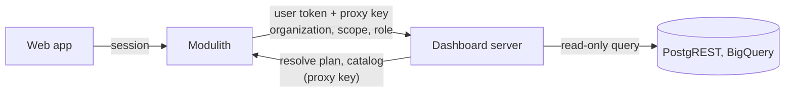

import { Callout, Steps } from 'nextra/components'

# Deploy with ModularIoT

In a ModularIoT installation the dashboard server runs next to the modulith. People sign in to the web app as usual; the modulith forwards their dashboard requests and tells the dashboard server which organization, scope and role it resolved. Queries use the organization's ModularIoT connections.



The browser only talks to the web app. It never sees the dashboard server, the proxy key or a credential.

## The shared key

One secret, the **proxy key**, links the modulith and the dashboard server in both directions. It must be at least 32 characters.

```bash
kubectl create secret generic dashboard-proxy \
  --from-literal=proxy-key="$(openssl rand -hex 32)"
```

Create it **before** deploying anything that references it. A pod that names a missing secret does not start, and that includes the modulith.

<Steps>

### Configure the dashboard server

```bash
# Who is calling: the same identity provider as the web app
MIOT_DASHBOARD_JWT_ISSUER=https://your-company.auth0.com/
MIOT_DASHBOARD_JWT_AUDIENCE=<the web app's API audience>
MIOT_DASHBOARD_JWT_JWKS_URL=https://your-company.auth0.com/.well-known/jwks.json

# Trust the modulith's assertions, and authenticate calls back to it
MIOT_DASHBOARD_PROXY_KEY=<from the secret>

# Run saved queries with the bundled ModularIoT module
MIOT_DASHBOARD_OPERATIONS_MODULE=/app/examples/modulariot-operations.mjs
MIOT_DASHBOARD_PLAN_URL=http://<modulith-service>:8180/internal/dashboard-operations/resolve
MIOT_DASHBOARD_PLAN_ALLOW_HTTP=true
MIOT_DASHBOARD_CATALOG_URL=http://<modulith-service>:8180/internal/dashboard-operations/catalog
MIOT_DASHBOARD_DATA_ORIGINS=https://data.example.com,https://other-data.example.com

MIOT_DASHBOARD_STORE=sqlite
```

| Setting | Why |
| --- | --- |
| `MIOT_DASHBOARD_PROXY_KEY` | Requests carrying it may assert organization, scope and role. A direct caller without it still gets 403. |
| `MIOT_DASHBOARD_PLAN_URL` | Where the server asks the modulith how to run an operation for an organization |
| `MIOT_DASHBOARD_PLAN_ALLOW_HTTP` | The modulith is on the private cluster network. Use `true` only for that. |
| `MIOT_DASHBOARD_CATALOG_URL` | Lets editors pick connections and operations. Without it, editing saved queries is unavailable. |
| `MIOT_DASHBOARD_DATA_ORIGINS` | The PostgREST origins queries may call. Anything else is refused. Leave empty for BigQuery only. |

### Configure the modulith

```bash
MIOT_DASHBOARD_BASE_URL=http://<dashboard-server-service>:3070
MIOT_DASHBOARD_PROXY_KEY=<from the same secret>
MIOT_DASHBOARDS_PLAN_RESOLUTION_ENABLED=true
```

`MIOT_DASHBOARDS_PLAN_RESOLUTION_ENABLED` sets `miot.dashboards.plan-resolution.enabled`, which is off by default. Organizations without a matching ECM site use the scope named by `MIOT_DASHBOARD_DEFAULT_SCOPE` (default `default`).

### Turn on the web app page

```bash
ENABLE_DASHBOARD_SERVER=true
```

Without it, **Dashboards** is hidden from the navigation and its pages return 404.

### Deploy in order

1. The secret.
2. The dashboard server.
3. The modulith.
4. The web app.

</Steps>

## Check it

1. Read the dashboard server's startup log. It should say:

   ```text
   identity: ... ; a trusted proxy may also assert tenant and role
   ```

2. Sign in to the web app and open **Dashboards**. An empty list with a **Create dashboard** button means the whole chain works.
3. Create a dashboard and add a saved query. If the connection list loads, the catalog works.

## Roles

The modulith maps each organization member's role to a dashboard role:

| ModularIoT (ECM site role) | Dashboard role |
| --- | --- |
| Site manager | Coordinator |
| Site collaborator | Editor |
| Site contributor | Contributor |
| Any other role, or none | Consumer |

<Callout type="info">
Values for these settings normally live in your deployment repository. A change made only with `helm upgrade` is replaced by the next deployment from that repository.
</Callout>
