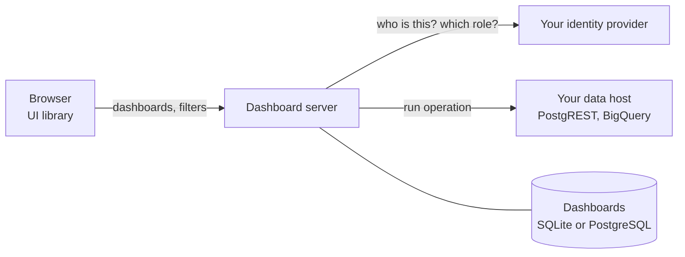

import { Cards } from 'nextra/components'

# Dashboards

ModularIoT Dashboards lets a team build, share and embed operational dashboards. People arrange widgets on a grid, connect them to approved data, and decide who can see or change each dashboard. The data stays behind your server: a dashboard names a query, never a password, a URL or SQL.

You can use it in two ways:

- **Inside the ModularIoT web app.** Open **Dashboards** in the navigation, create a dashboard and add widgets. No code is needed.
- **In your own product.** Run the dashboard server, then draw dashboards in any web page with the UI library. It works with React, with plain HTML, and with any framework that can host a Web Component.

## What you get

| Capability | What it means for you |
| --- | --- |
| Grid editor | Drag and resize widgets on a 24-column grid. Changes save on their own. |
| Widget catalog | Text, statistics, progress, status, tables, lists, charts and cards that hold other widgets. |
| Saved queries | Widgets read named results. An administrator decides which data operations exist. |
| Filters | Text, date range and selection filters. Selection options can come from query results. |
| Sharing | Four roles per scope, plus extra roles per dashboard for people or groups. |
| Organizations | Each organization's dashboards and data stay apart. One person can work in several. |
| Safe editing | Every save checks the revision, so two editors never overwrite each other. |
| Import and export | Move a dashboard between environments as one JSON file. |

## The three packages

Dashboards ships as three open-source npm packages under the Apache 2.0 license.

| Package | Version | Does |
| --- | --- | --- |
| [`@microboxlabs/miot-dashboard-server`](/en/products/dashboards/reference/server-library) | 0.6.0 | Stores dashboards, checks every request, runs saved queries. |
| [`@microboxlabs/miot-dashboard-ui`](/en/products/dashboards/reference/ui-library) | 0.1.0 | Draws and edits dashboards in the browser. |
| [`@microboxlabs/miot-dashboard-contract`](/en/products/dashboards/reference/contract) | 0.6.0 | The document format, roles, errors and OpenAPI definition both sides share. |

The server also ships as a container image and a Helm chart. See [Installation](/en/products/dashboards/getting-started/installation).

## How it fits together

The browser asks the server for a dashboard and for query results. The server checks who is asking, which organization and scope they belong to, and what their role allows. Only then does it run the query, with credentials the browser never sees. Read [Architecture](/en/products/dashboards/concepts/architecture) for the details.

## Start here

<Cards>
  <Cards.Card title="Quickstart" href="/en/products/dashboards/getting-started/quickstart" arrow />
  <Cards.Card title="Build your first dashboard" href="/en/products/dashboards/tutorials/first-dashboard" arrow />
  <Cards.Card title="Embed a dashboard in a web page" href="/en/products/dashboards/tutorials/embed-in-a-web-page" arrow />
  <Cards.Card title="Deploy with Docker" href="/en/products/dashboards/deployment/docker" arrow />
  <Cards.Card title="Configuration reference" href="/en/products/dashboards/reference/configuration" arrow />
  <Cards.Card title="Troubleshooting" href="/en/products/dashboards/troubleshooting" arrow />
</Cards>

## How this guide is organized

| Section | Read it when you want to |
| --- | --- |
| Getting started | Run the server for the first time and pick a setup |
| Tutorials | Learn by building something, step by step |
| How-to guides | Finish one task, such as adding a filter or connecting BigQuery |
| Concepts | Understand how the parts work and why |
| Deployment | Run it in production and keep it up to date |
| Reference | Look up a setting, a route, a field or a limit |
| Troubleshooting | Fix an error |
| Releases and versions | Check what changed and which versions work together |
