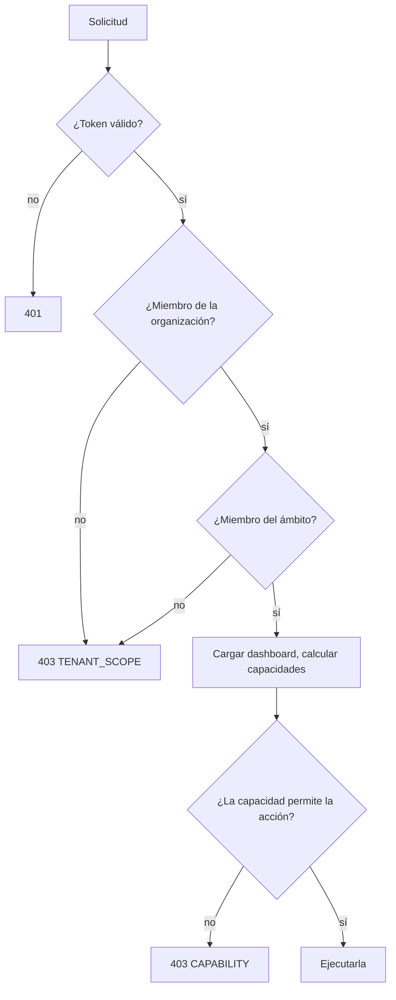

# Organizaciones, ámbitos y roles

El acceso a un dashboard depende de tres cosas: la organización, el ámbito dentro de ella y el rol que la persona tiene ahí.

## Vocabulario

| Término | Es | En la dirección |
| --- | --- | --- |
| Organización (tenant) | Un cliente o empresa. Sus dashboards y datos nunca se mezclan con los de otra. | `/tenants/{tenantId}` |
| Ámbito | Un área dentro de la organización: un equipo, un sitio, una región | `/scopes/{scopeId}` |
| Rol | Lo que una persona puede hacer en un ámbito | No está en la dirección; se consulta en cada solicitud |
| Permiso del dashboard | Un rol adicional que un dashboard otorga a una persona o grupo | `/dashboards/{slug}/permissions` |

Una persona puede pertenecer a varias organizaciones, con un rol distinto en cada una. Cambiar de organización es usar otra dirección, no un token nuevo.

## Roles

Los roles tienen un orden. Cada uno puede hacer todo lo que pueden hacer los roles anteriores.

| Rol | Ver | Crear | Editar propios | Editar cualquiera | Compartir | Gestionar permisos | Eliminar |
| --- | --- | --- | --- | --- | --- | --- | --- |
| Consumer | ✓ | | | | | | |
| Contributor | ✓ | ✓ | ✓ | | | | |
| Editor | ✓ | ✓ | ✓ | ✓ | ✓ | | |
| Coordinator | ✓ | ✓ | ✓ | ✓ | ✓ | ✓ | ✓ |

"Editar propios" se refiere a los dashboards que la persona creó. El servidor registra al creador en el primer guardado.

## Cómo se verifica una solicitud

Una organización a la que la persona no pertenece y una que no existe dan la misma respuesta. Lo mismo ocurre con un ámbito. Nadie puede usar la dirección para averiguar qué existe.

## Capacidades

El servidor convierte el rol, los permisos del dashboard y su política en cinco indicadores. La UI los usa para decidir qué controles mostrar:

| Capacidad | Permite |
| --- | --- |
| `readOnly` | Nada más que ver, cuando es verdadero |
| `canEdit` | Guardar el dashboard |
| `canShare` | Compartirlo |
| `canManagePermissions` | Cambiar sus permisos |
| `canDelete` | Eliminarlo |

Crear un dashboard se decide a nivel de ámbito: `GET /tenants/{t}/scopes/{s}/capabilities` devuelve `{"canCreate": true}` para Contributor y roles superiores.

## Cómo se combinan los roles

- **Los permisos del dashboard suman.** Un Consumer en el ámbito con un permiso Editor en un dashboard puede editar ese dashboard.
- **Las políticas solo restan.** `allowedGroups`, o una política personalizada en un servidor embebido, puede ocultar un dashboard a alguien cuyo rol lo permitiría. Nunca pueden otorgar más que el rol.
- **La identidad fija un límite.** Si el token o el ticket dice que una persona no puede editar, ningún rol ni permiso se lo permite.

## De dónde vienen las membresías

| Configuración | Membresía en organización y ámbito |
| --- | --- |
| Aplicación web de ModularIoT | Organizaciones y roles de ModularIoT |
| Independiente, pequeña | Un archivo de membresías (`MIOT_DASHBOARD_SEED`) |
| Independiente, con un directorio | Consultas a su directorio (`MIOT_DASHBOARD_TENANTS_URL`, `MIOT_DASHBOARD_SCOPES_URL`) |

Consulte [Autenticar usuarios](/es/products/dashboards/how-to/authenticate-users).
