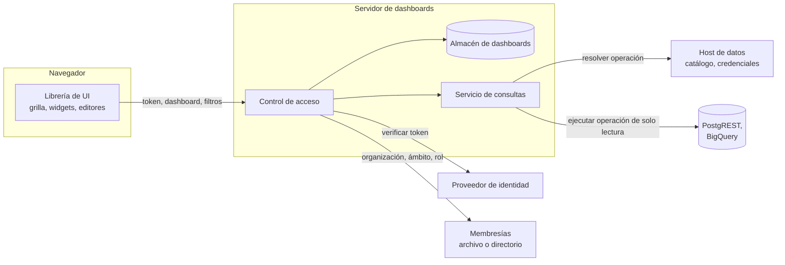

# Arquitectura

Dashboards reparte el trabajo entre el navegador, el servidor de dashboards y los sistemas que usted ya opera. Cada parte hace una sola tarea, y los secretos nunca se mueven hacia el navegador.

## Las partes

| Parte | Hace | No hace |
| --- | --- | --- |
| **Librería de UI** | Dibuja widgets, organiza la grilla, edita documentos, muestra resultados de consultas | Guardar tokens, tener credenciales, ejecutar SQL, decidir el acceso |
| **Servidor de dashboards** | Guarda documentos, verifica cada solicitud, ejecuta consultas guardadas dentro de límites | Renderizar páginas, mantener sesiones |
| **Contrato** | Define el documento, los roles, los errores y la API que usan ambos lados | Ejecutar nada |
| **Proveedor de identidad** | Inicia la sesión de las personas y emite tokens | Saber de dashboards |
| **Host de datos** | Es dueño de las conexiones, operaciones y credenciales | Aceptar SQL o URL desde los dashboards |

## Una solicitud, paso a paso

Cuando una persona abre un dashboard:

1. La página pide el dashboard al servidor, con el token de la persona.
2. El servidor verifica el token y luego comprueba que la persona pertenece a la organización y al ámbito de la dirección. Si falla, se detiene aquí con 401 o 403.
3. El servidor carga el documento, calcula las capacidades de la persona y devuelve ambos con la revisión actual.
4. La página dibuja los widgets y pide los resultados de cada consulta guardada, enviando solo valores de filtros.
5. Para cada consulta, el servidor vuelve a verificar el acceso, toma la operación y los vínculos de parámetros del documento **guardado** y completa los valores de los filtros.
6. El host de datos resuelve la operación para esa organización: la conexión, la credencial y cualquier predicado de organización.
7. El servidor ejecuta la operación de solo lectura con plazos y límites de tamaño, y devuelve solo filas.

El navegador nunca envía una conexión, una definición de operación, una URL ni SQL. Solo nombra una consulta guardada por su ID.

## Dos lugares para ejecutar consultas

| Dónde | Cómo | Úselo para |
| --- | --- | --- |
| En el servidor de dashboards | Un módulo ejecutor de consultas resuelve el plan con el host de datos y luego llama a PostgREST o BigQuery por sí mismo | La configuración estándar, incluso con ModularIoT |
| En el host de datos | El servidor reenvía la solicitud autorizada a un endpoint privado del host, que la ejecuta | Hosts que deben ejecutar las consultas por sí mismos |

En ambos casos el navegador ve la misma API. Consulte [Consultas y conexiones](/es/products/dashboards/concepts/queries-and-connections).

## Formas de despliegue

| Forma | El servidor se ejecuta como | Identidad | Credenciales |
| --- | --- | --- | --- |
| Con ModularIoT | Un pod junto al modulith | La sesión de la aplicación web, reenviada por su proxy | Conexiones de ModularIoT |
| Independiente | npm, Docker o Helm | Su emisor de JWT o de tickets | El almacén cifrado del servidor, u otro sistema |
| Librería embebida | Dentro de su backend Node.js | Su código | Su código |

## Reglas de diseño

- **Fallar cerrado.** Un valor desconocido, una lista de grupos mal formada o un directorio inalcanzable niegan el acceso. Nunca lo otorgan.
- **Misma respuesta para "no es suyo" y "no existe".** La dirección no sirve para descubrir organizaciones, ámbitos ni dashboards.
- **Ningún secreto en una respuesta.** Las rutas de credenciales devuelven resúmenes. Los errores no incluyen detalles del sistema de origen.
- **Trabajo acotado.** Cada consulta tiene un plazo, un límite de filas, un límite de tamaño y un límite de concurrencia.
- **El documento es portable.** Los campos desconocidos se conservan en cada guardado, así que una UI más nueva y un servidor más antiguo pueden compartir documentos.
