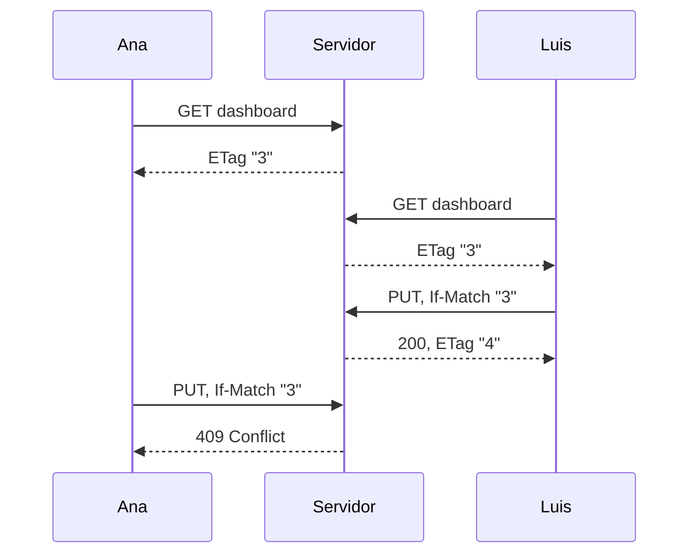

# Revisiones y guardado

Dos personas pueden editar el mismo dashboard al mismo tiempo. Las revisiones aseguran que ninguna sobrescriba a la otra sin aviso.

## Cómo funcionan las revisiones

Cada dashboard tiene un número de revisión que aumenta en uno con cada guardado.

1. Al cargar un dashboard, su revisión llega en el encabezado `ETag`, por ejemplo `"3"`.
2. Al guardar, ese valor se devuelve en `If-Match: "3"`.
3. Si el dashboard sigue en la revisión 3, el guardado funciona y devuelve `ETag: "4"`.
4. Si alguien guardó entre medio, el servidor responde **409 Conflict** y no guarda nada.

## Crear sin sobrescribir

Un dashboard que no existe se carga como `data: null` con `ETag: "0"`. Guardar con `If-Match: "0"` lo crea solo si nadie más lo creó antes.

## Después de un conflicto

Conserve los cambios de la persona y permítale compararlos con la última versión. No reenvíe el documento antiguo con la revisión nueva: eso borraría los cambios de la otra persona.

En la aplicación web, un conflicto muestra **Cambios sin guardar** y un botón **Recargar**. Sus cambios siguen en pantalla hasta que recargue.

## Guardado automático

La aplicación web guarda por sí sola unos 1,5 segundos después de que usted deja de editar. No guarda mientras hay un guardado en curso, y se detiene después de un guardado fallido hasta que usted actúe. Las aplicaciones React obtienen el mismo comportamiento con `useDashboardAutosave`.

## Eliminar y reutilizar una dirección

Eliminar un dashboard conserva su contador de revisiones. Si alguien crea un dashboard nuevo en la misma dirección, empieza por encima de la revisión anterior. Un editor que todavía tiene abierto el dashboard antiguo recibe un conflicto en lugar de sobrescribir el nuevo.

## Guardados sin revisión

Un `PUT` sin `If-Match` reemplaza el dashboard sin condiciones. Existe para clientes antiguos. En código nuevo, envíe siempre `If-Match`.
