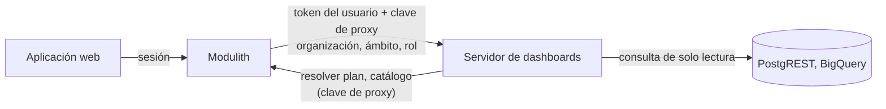

import { Callout, Steps } from 'nextra/components'

# Desplegar con ModularIoT

En una instalación de ModularIoT, el servidor de dashboards se ejecuta junto al modulith. Las personas inician sesión en la aplicación web como siempre; el modulith reenvía sus solicitudes de dashboards e indica al servidor de dashboards qué organización, ámbito y rol resolvió. Las consultas usan las conexiones de ModularIoT de la organización.



El navegador solo se comunica con la aplicación web. Nunca ve el servidor de dashboards, la clave de proxy ni una credencial.

## La clave compartida

Un secreto, la **clave de proxy**, une el modulith y el servidor de dashboards en ambas direcciones. Debe tener al menos 32 caracteres.

```bash
kubectl create secret generic dashboard-proxy \
  --from-literal=proxy-key="$(openssl rand -hex 32)"
```

Créelo **antes** de desplegar cualquier cosa que haga referencia a él. Un pod que nombra un secreto inexistente no inicia, y eso incluye al modulith.

<Steps>

### Configurar el servidor de dashboards

```bash
# Quién llama: el mismo proveedor de identidad que la aplicación web
MIOT_DASHBOARD_JWT_ISSUER=https://your-company.auth0.com/
MIOT_DASHBOARD_JWT_AUDIENCE=<la audiencia de la API de la aplicación web>
MIOT_DASHBOARD_JWT_JWKS_URL=https://your-company.auth0.com/.well-known/jwks.json

# Confiar en las afirmaciones del modulith y autenticar las llamadas de vuelta hacia él
MIOT_DASHBOARD_PROXY_KEY=<del secreto>

# Ejecutar consultas guardadas con el módulo de ModularIoT incluido
MIOT_DASHBOARD_OPERATIONS_MODULE=/app/examples/modulariot-operations.mjs
MIOT_DASHBOARD_PLAN_URL=http://<servicio-del-modulith>:8180/internal/dashboard-operations/resolve
MIOT_DASHBOARD_PLAN_ALLOW_HTTP=true
MIOT_DASHBOARD_CATALOG_URL=http://<servicio-del-modulith>:8180/internal/dashboard-operations/catalog
MIOT_DASHBOARD_DATA_ORIGINS=https://data.example.com,https://other-data.example.com

MIOT_DASHBOARD_STORE=sqlite
```

| Configuración | Por qué |
| --- | --- |
| `MIOT_DASHBOARD_PROXY_KEY` | Las solicitudes que la incluyen pueden afirmar organización, ámbito y rol. Quien llame directamente sin ella sigue recibiendo 403. |
| `MIOT_DASHBOARD_PLAN_URL` | Dónde el servidor pregunta al modulith cómo ejecutar una operación para una organización |
| `MIOT_DASHBOARD_PLAN_ALLOW_HTTP` | El modulith está en la red privada del clúster. Use `true` solo para ese caso. |
| `MIOT_DASHBOARD_CATALOG_URL` | Permite a los editores elegir conexiones y operaciones. Sin ella, no se pueden editar consultas guardadas. |
| `MIOT_DASHBOARD_DATA_ORIGINS` | Los orígenes de PostgREST a los que pueden llamar las consultas. Cualquier otro se rechaza. Déjela vacía si solo usa BigQuery. |

### Configurar el modulith

```bash
MIOT_DASHBOARD_BASE_URL=http://<servicio-del-servidor-de-dashboards>:3070
MIOT_DASHBOARD_PROXY_KEY=<del mismo secreto>
MIOT_DASHBOARDS_PLAN_RESOLUTION_ENABLED=true
```

`MIOT_DASHBOARDS_PLAN_RESOLUTION_ENABLED` configura `miot.dashboards.plan-resolution.enabled`, que está desactivada de forma predeterminada. Las organizaciones sin un sitio ECM correspondiente usan el ámbito indicado por `MIOT_DASHBOARD_DEFAULT_SCOPE` (predeterminado `default`).

### Activar la página en la aplicación web

```bash
ENABLE_DASHBOARD_SERVER=true
```

Sin esta variable, **Dashboards** no aparece en la navegación y sus páginas devuelven 404.

### Desplegar en orden

1. El secreto.
2. El servidor de dashboards.
3. El modulith.
4. La aplicación web.

</Steps>

## Verificar

1. Lea el log de inicio del servidor de dashboards. Debe decir:

   ```text
   identity: ... ; a trusted proxy may also assert tenant and role
   ```

2. Inicie sesión en la aplicación web y abra **Dashboards**. Una lista vacía con un botón **Crear dashboard** significa que toda la cadena funciona.
3. Cree un dashboard y agregue una consulta guardada. Si la lista de conexiones carga, el catálogo funciona.

## Roles

El modulith asigna el rol de cada miembro de la organización a un rol de dashboard:

| ModularIoT (rol en el sitio ECM) | Rol de dashboard |
| --- | --- |
| Site manager | Coordinator |
| Site collaborator | Editor |
| Site contributor | Contributor |
| Cualquier otro rol, o ninguno | Consumer |

<Callout type="info">
Los valores de estas configuraciones normalmente están en su repositorio de despliegue. Un cambio hecho solo con `helm upgrade` se reemplaza en el siguiente despliegue desde ese repositorio.
</Callout>
