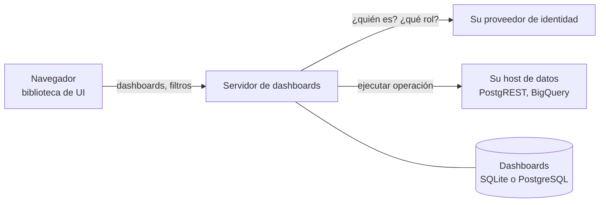

import { Cards } from 'nextra/components'

# Dashboards

ModularIoT Dashboards permite a un equipo construir, compartir e incrustar dashboards operacionales. Las personas ordenan widgets en una grilla, los conectan a datos autorizados y deciden quién puede ver o cambiar cada dashboard. Los datos quedan detrás de su servidor: un dashboard nombra una consulta, nunca una contraseña, una URL ni SQL.

Puede usarlo de dos formas:

- **Dentro de la aplicación web de ModularIoT.** Abra **Dashboards** en la navegación, cree un dashboard y agregue widgets. No necesita escribir código.
- **En su propio producto.** Ejecute el servidor de dashboards y luego dibuje dashboards en cualquier página web con la biblioteca de UI. Funciona con React, con HTML simple y con cualquier framework que pueda alojar un Web Component.

## Qué obtiene

| Capacidad | Qué significa para usted |
| --- | --- |
| Editor de grilla | Arrastre y cambie el tamaño de los widgets en una grilla de 24 columnas. Los cambios se guardan solos. |
| Catálogo de widgets | Texto, estadísticas, progreso, estado, tablas, listas, gráficos y tarjetas que contienen otros widgets. |
| Consultas guardadas | Los widgets leen resultados con nombre. Un administrador decide qué operaciones de datos existen. |
| Filtros | Filtros de texto, rango de fechas y selección. Las opciones de selección pueden venir de resultados de consultas. |
| Compartir | Cuatro roles por ámbito, más roles adicionales por dashboard para personas o grupos. |
| Organizaciones | Los dashboards y datos de cada organización se mantienen separados. Una persona puede trabajar en varias. |
| Edición segura | Cada guardado revisa la revisión, así dos editores nunca se sobrescriben entre sí. |
| Importar y exportar | Mueva un dashboard entre entornos como un solo archivo JSON. |

## Los tres paquetes

Dashboards se distribuye como tres paquetes npm de código abierto bajo la licencia Apache 2.0.

| Paquete | Versión | Función |
| --- | --- | --- |
| [`@microboxlabs/miot-dashboard-server`](/es/products/dashboards/reference/server-library) | 0.6.0 | Guarda dashboards, revisa cada solicitud y ejecuta consultas guardadas. |
| [`@microboxlabs/miot-dashboard-ui`](/es/products/dashboards/reference/ui-library) | 0.1.0 | Dibuja y edita dashboards en el navegador. |
| [`@microboxlabs/miot-dashboard-contract`](/es/products/dashboards/reference/contract) | 0.6.0 | El formato del documento, los roles, los errores y la definición OpenAPI que comparten ambos lados. |

El servidor también se distribuye como imagen de contenedor y como chart de Helm. Consulte [Instalación](/es/products/dashboards/getting-started/installation).

## Cómo encajan las partes

El navegador pide al servidor un dashboard y los resultados de las consultas. El servidor revisa quién pregunta, a qué organización y ámbito pertenece y qué permite su rol. Solo entonces ejecuta la consulta, con credenciales que el navegador nunca ve. Lea [Arquitectura](/es/products/dashboards/concepts/architecture) para ver los detalles.

## Comience aquí

<Cards>
  <Cards.Card title="Inicio rápido" href="/es/products/dashboards/getting-started/quickstart" arrow />
  <Cards.Card title="Construir su primer dashboard" href="/es/products/dashboards/tutorials/first-dashboard" arrow />
  <Cards.Card title="Incrustar un dashboard en una página web" href="/es/products/dashboards/tutorials/embed-in-a-web-page" arrow />
  <Cards.Card title="Desplegar con Docker" href="/es/products/dashboards/deployment/docker" arrow />
  <Cards.Card title="Referencia de configuración" href="/es/products/dashboards/reference/configuration" arrow />
  <Cards.Card title="Solución de problemas" href="/es/products/dashboards/troubleshooting" arrow />
</Cards>

## Cómo está organizada esta guía

| Sección | Léala cuando quiera |
| --- | --- |
| Primeros pasos | Ejecutar el servidor por primera vez y elegir una configuración |
| Tutoriales | Aprender construyendo algo, paso a paso |
| Guías prácticas | Terminar una tarea, como agregar un filtro o conectar BigQuery |
| Conceptos | Entender cómo funcionan las partes y por qué |
| Despliegue | Ejecutarlo en producción y mantenerlo actualizado |
| Referencia | Consultar un ajuste, una ruta, un campo o un límite |
| Solución de problemas | Corregir un error |
| Versiones y compatibilidad | Revisar qué cambió y qué versiones funcionan juntas |
